# Roadmap Сайт школы № 29

> План развития: от первой полезной версии до полной картины. См. также: docs/plan.md (детали), docs/context.md (цель), docs/anti-features.md (запреты).

## Диаграмма

```mermaid
flowchart LR
    E1["Этап 1<br/>исследование гос. требований,<br/>анализ сайта, выбор стека"] --> E2
    E2["Этап 2 · Информационная архитектура"] --> E3
    E3["Этап 3 · Дизайн через OpenDesign"] --> E4
    E4["Этап 4 · Проект Astro, интеграция дизайна"] --> E5
    E5["Этап 5 · Компоненты, Decap CMS"] --> E6
    E6["Этап 6 · Перенос контента с Nubex"] --> E7
    E7["Этап 7 · Проверки и полировка"] --> E8
    E8["Этап 8 · Навигация и ссылки"] --> E9
    E9["Этап 9 · Лечение сайта (docs/errors.md)"] --> E10
    E10["Позже<br/>реальный запуск: хостинг РФ, домен"]
```

## Таблица этапов

| Этап | Название | Что появляется у пользователя | Статус (⬜🟡✅) |
|---|---|---|---|
| 1 | Исследование гос. требований, анализ текущего сайта, выбор стека | — | ✅ |
| 2 | Информационная архитектура | структура разделов и навигация (утверждены владельцем) | ✅ |
| 3 | Дизайн через OpenDesign | дизайн-проект school29, одобренный владельцем | ✅ |
| 4 | Создание проекта Astro, интеграция дизайна | сайт собирается локально, дизайн перенесён 1:1 | ✅ |
| 5 | Рефакторинг в компоненты, Decap CMS, настройка редактирования | редактирование контента через веб-интерфейс (все коллекции подключены) | ✅ |
| 6 | Перенос контента с текущего сайта (Nubex), наполнение | реальные контакты, педсостав (75), тексты 14 подразделов «Сведений» | ✅ |
| 7 | Проверки (доступность, скорость, валидность), полировка | Lighthouse Perf 99–100, A11y 100, BP 100, SEO 100 | ✅ |
| 8 | Навигация и ссылки | 52 страницы, битых ссылок и заглушек href="#" нет | ✅ |
| 9 | Лечение сайта (по docs/errors.md) | закрытие ошибок журнала: 9.1–9.3 завершены, 9.4 в работе | 🟡 |
| Позже | Реальный запуск | российский хостинг, домен, публикация (по решению владельца) | ⬜ |

## Ограничители

- **Первая полезная версия:** этапы 1–8 завершены — сайт опубликован и готов (https://ntiwgg.github.io/school29-site/). Этап 9 «Лечение сайта» — закрытие ошибок docs/errors.md.
- **Anti-features:** до первой полезной версии запрещено всё из docs/anti-features.md.

## Правило

Объём этапа адаптивен (можно сузить), принципы — нет (docs/invariants.md). Название и принятые решения не меняются без записи в docs/decisions.md.
