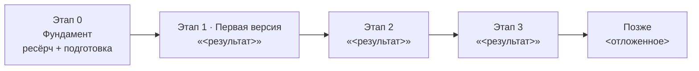

# Roadmap {{PROJECT_NAME}}

> План развития: от первой полезной версии до полной картины. См. также: docs/plan.md (детали), docs/context.md (цель), docs/anti-features.md (запреты).

## Диаграмма

## Таблица этапов

| Этап | Название | Что появляется у пользователя | Статус (⬜🟡✅) |
|---|---|---|---|
| 0 | Фундамент | — | ⬜ |
| 1 | Первая полезная версия | <!-- Заполнить: главный результат --> | ⬜ |
| 2 | <!-- Заполнить: название --> | <!-- Заполнить: результат --> | ⬜ |
| 3 | <!-- Заполнить: название --> | <!-- Заполнить: результат --> | ⬜ |
| Позже | <!-- Заполнить: название --> | <!-- Заполнить: результат --> | ⬜ |

## Ограничители

- **Первая полезная версия:** <!-- Заполнить: критерий готовности. --> Всё остальное — после неё.
- **Anti-features:** до первой полезной версии запрещено всё из docs/anti-features.md.

## Правило

Объём этапа адаптивен (можно сузить), принципы — нет (docs/invariants.md). Название и принятые решения не меняются без записи в docs/decisions.md.
